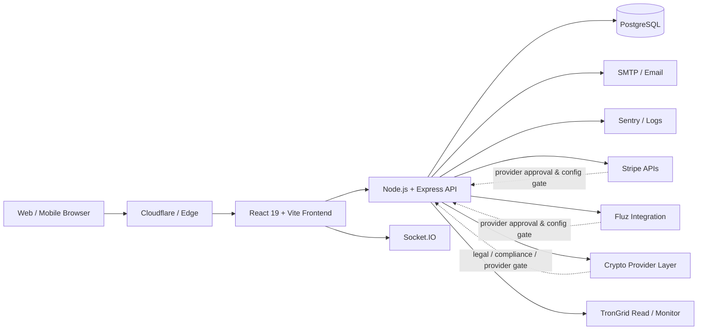

# CardXC — Digital Wallet & Payments Platform

[](https://github.com/whogf22/cardxc-online-1/actions/workflows/ci.yml)
[](https://github.com/whogf22/cardxc-online-1/stargazers)

**Live site:** https://cardxc.online  
**API docs:** `/api-docs` when the backend is running  
**Current package version:** `0.1.0`

CardXC is a React + Node.js fintech platform operated by **CARDXC LLC**. The codebase contains wallet management, transaction workflows, virtual-card experiences, gift-card integrations, payment flows, security controls, notifications, administrative tooling, and provider integrations.

> **Important:** technical integration is not the same as provider approval, licensing, or production authorization. Provider-gated financial functionality must remain conditional or disabled until the relevant external and internal release gates are satisfied.

## Product status

| Capability | Code status | Production / business status |
| --- | --- | --- |
| Multi-currency wallet (USD, EUR, GBP, NGN, BDT) | Implemented foundation | Environment and feature configuration apply |
| Wallet transactions / internal transfer workflows | Implemented foundation | Production use requires operational and reconciliation checks |
| Virtual-card workflows | Integrated | **Provider-gated**; external approval not inferred from code |
| Stripe Checkout / payment webhooks | Integrated with verification controls | **Conditional**; production configuration and provider approval must be verified |
| Gift cards / Fluz workflows | Integrated | **Provider-gated**; provider agreement/approval must be verified |
| Crypto payout providers | Code paths present | **Not a production-ready claim**; legal/licensing/provider review required |
| TronGrid deposit monitoring | Technically hardened | Production availability remains tied to crypto/compliance gates |
| 2FA, rate limiting, fraud/security controls | Implemented foundations | Monitor and test continuously |
| Sentry frontend error tracking | Integrated for production | DSN/release/alert configuration must be verified per environment |
| Swagger API documentation | Implemented | Protect sensitive/admin endpoints appropriately |
| Public company/support/legal pages | Implemented | Content must remain accurate and current |

Detailed provider status lives in [`docs/payment-provider-readiness.md`](docs/payment-provider-readiness.md) and the broader release gate in [`docs/PAYMENT_GATEWAY_MASTER_READINESS.md`](docs/PAYMENT_GATEWAY_MASTER_READINESS.md).

## Architecture



### Financial safety model

Money-changing operations should be designed around:

- server-authoritative amounts and currencies;
- authentication and authorization before state changes;
- idempotency and replay protection;
- database transactions / row locking where required;
- verified provider webhooks;
- fail-closed environment and provider gates;
- audit logging and production error monitoring;
- reconciliation between CardXC state and external providers;
- explicit recovery behavior for partial failures.

## Key features

- **Wallets:** multi-currency balance and transaction foundations.
- **Virtual cards:** issuance/management workflows, subject to provider and eligibility gates.
- **Gift cards:** catalog, pricing, request, and fulfillment integration foundations.
- **Payments:** Stripe Checkout and webhook processing foundations.
- **Transactions:** P2P/internal transfer, payment-link, and QR-related workflows in the application.
- **Crypto:** deposit/withdrawal code paths with production use gated separately from technical integration.
- **Savings & rewards:** vault, budget, round-up, cashback/referral, and subscription-related product foundations.
- **Security:** 2FA, fraud-oriented checks, device/security controls, webhook verification, and rate limiting.
- **Real-time:** Socket.IO notifications.
- **Admin:** analytics, user management, KYC/security/operations tooling.

## Technology stack

| Layer | Technology |
| --- | --- |
| Frontend | React 19, TypeScript, Vite, Tailwind CSS |
| Backend | Node.js, Express 5, TypeScript (ESM) |
| Database | PostgreSQL |
| Real-time | Socket.IO |
| Validation | Zod / express-validator |
| Observability | Sentry, application logging, Cloudflare observability |
| API docs | Swagger / OpenAPI |
| Edge/deploy | Cloudflare Wrangler / Assets |

## Quick start — local development

### Prerequisites

- Node.js 20+
- PostgreSQL 16+ recommended

### 1. Install

```bash
git clone https://github.com/whogf22/cardxc-online-1.git
cd cardxc-online-1
npm ci
```

### 2. Create a development environment

```bash
npm run setup
```

Review the generated `.env` and set a local `DATABASE_URL`. Do not use production credentials for local development and never commit `.env` files.

### 3. Prepare the local database

```bash
createdb cardxc
npm run db:schema
```

Optional local test users:

```bash
npm run db:seed
```

### 4. Run

```bash
npm run dev
```

For the full local setup and troubleshooting guide, see [`DEVELOPMENT.md`](DEVELOPMENT.md).

## Quality checks

Every pull request should pass the same checks as CI:

```bash
npm run lint
npm run type-check:all
npm test
npm run build
```

The GitHub Actions workflow in [`.github/workflows/ci.yml`](.github/workflows/ci.yml) runs these checks automatically.

## API documentation

Swagger documentation is available at:

```text
/api-docs
```

Public documentation should never be treated as authorization. Sensitive endpoints continue to require their normal authentication and authorization controls.

## Project structure

```text
├── src/                    # React frontend
│   ├── components/         # Shared UI components
│   ├── pages/              # Route pages
│   ├── contexts/           # React contexts
│   ├── hooks/              # Custom hooks
│   ├── lib/                # API client / utilities / observability
│   └── router/             # Route configuration
├── server/                 # Express backend
│   ├── routes/             # API route handlers
│   ├── services/           # Business logic / provider integrations
│   ├── db/                 # Database pool / schema / migrations
│   ├── middleware/         # Auth / rate limiting / logging
│   └── config/             # Swagger / runtime configuration
├── scripts/                # Operational / setup / validation scripts
├── docs/                   # Audit and readiness documentation
├── public/                 # Static assets and edge headers
└── .github/workflows/      # CI and automation
```

## Security

Read [`SECURITY.md`](SECURITY.md) before reporting a vulnerability. Do not disclose exploitable vulnerabilities, secrets, customer data, or fund-moving weaknesses in a public issue.

Security-related implementation principles include:

- fail closed when required production secrets are missing;
- keep administrative and user authorization boundaries explicit;
- do not expose provider credentials or internal provider identifiers to users;
- verify signatures before trusting webhooks;
- maintain idempotency for credit/debit events;
- never weaken financial controls only to make a test or demo pass.

## Contributing

See [`CONTRIBUTING.md`](CONTRIBUTING.md). Fintech-sensitive changes have additional review requirements covering authorization, idempotency, reconciliation, audit logs, and failure recovery.

## Releases and changelog

See [`CHANGELOG.md`](CHANGELOG.md).

CardXC is currently versioned as **`0.1.0`**. A `v1.0.0` tag should be created only after production release criteria are actually met; it should not be used as a cosmetic trust badge.

### `v1.0.0` release gate

Before calling the platform 1.0 / production-ready, verify at minimum:

- CI, type-check, tests, and production build are green;
- public routes and core onboarding flows pass smoke tests;
- no unverified provider/coverage/compliance claims are published;
- production provider keys/webhook secrets and approvals are verified through approved operational processes;
- KYC/AML/sanctions requirements for enabled flows are enforced;
- ledger/idempotency/reconciliation tests cover duplicate and partial-failure cases;
- backup restore and incident-response procedures have been tested;
- monitoring and alert ownership are configured;
- high-risk features remain fail-closed when any required gate is missing.

## License

No open-source license is currently granted by this repository. Unless and until a license is added by the owner, normal copyright restrictions apply.

---

Maintained by the CardXC team. Public product claims and provider statuses should always be kept in sync with the actual deployment and external approvals.
